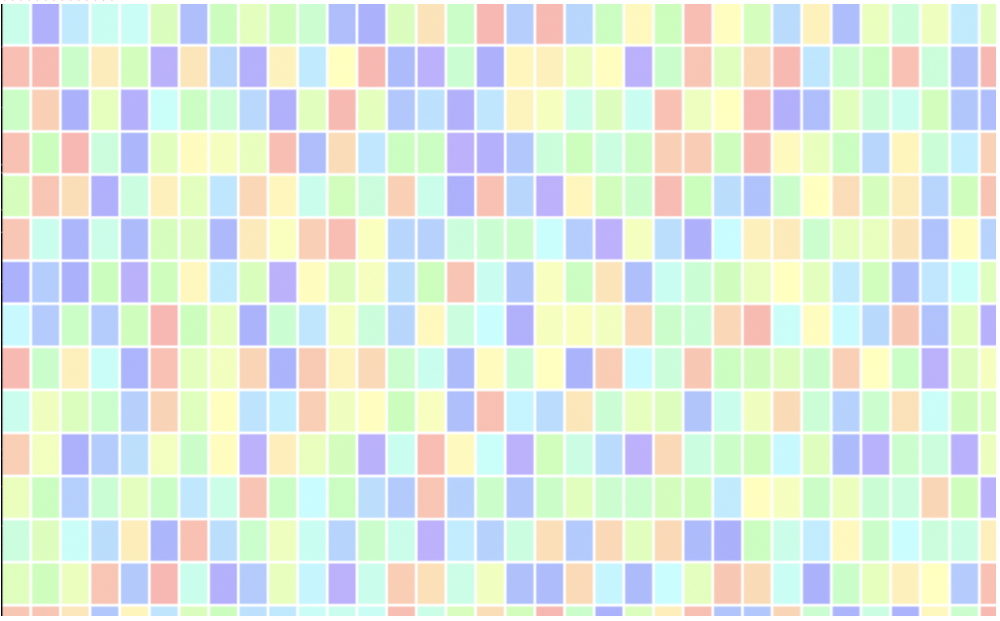
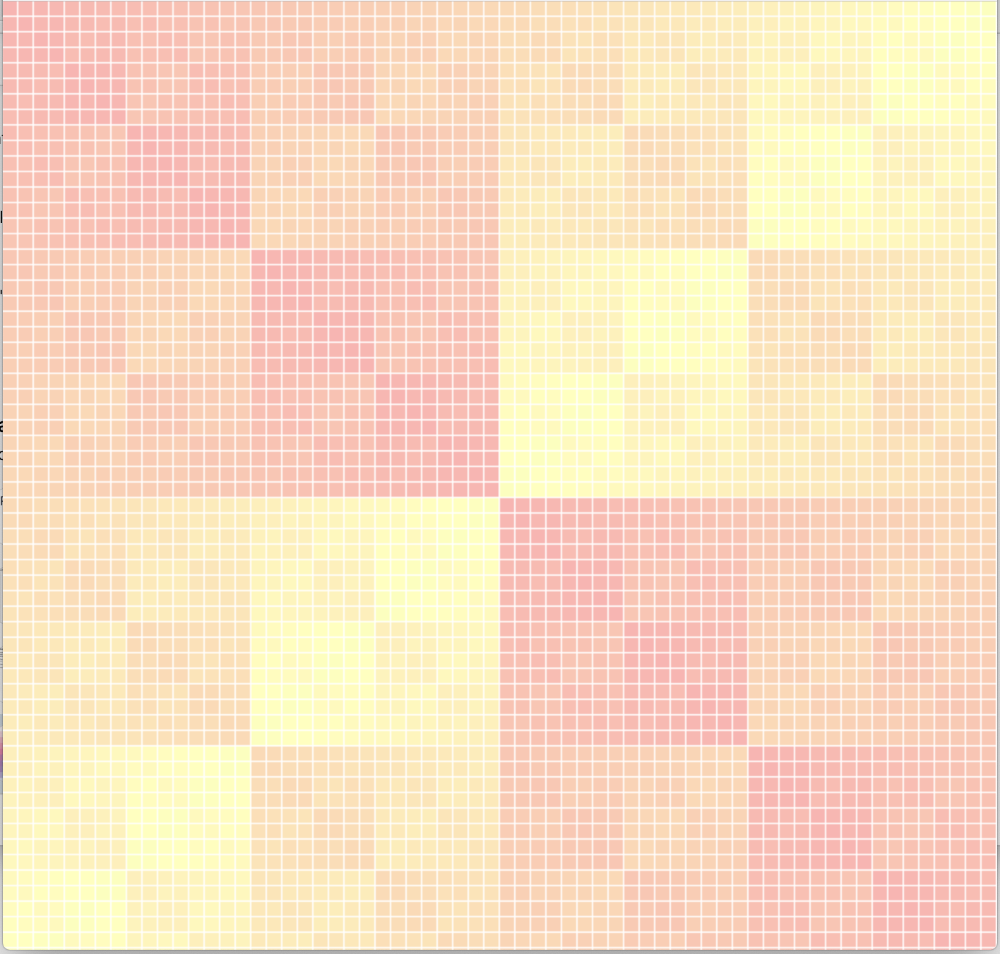

# Making Spaces - a really easy way to create background graphics for your websites

Look at `drawGridXOR`!

Screenshots:

- 
- 

Featuring:

- perlin noise
- rendering technologies
- custom (good) color palettes
- magic inference --> upload an image, and it uses it as a base for inspiration!
